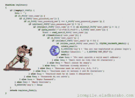

  
  <!-- Header with Name and Welcome GIF -->
  <h1 align="center">
    
    Carter Tierney
  </h1>
  
  <!-- About Me Section -->
  <h2>About Me</h2>
  

    <!-- Add your about me content here -->
  

  
  
  
  <!-- Animated Header -->
  
  
  
  

---

## 🐱 **LIVE CODING ACTIVITY** 🐈‍⬛

  
  
  
  <!-- Live Activity Indicator -->
  

    
  

  
  <!-- Recent Activity Badge -->
  

    
  

  

---

## 🐈 **📊 GITHUB STATS 📊** 🐱

  
  
  
  <!-- Top Languages -->
  
  

<!-- Detailed Stats Cards -->

  
  
  

---

## **Powerlifting Stats**

  
  
  
  
  

  

  
  **SQUAT** `565 lbs` | **BENCH** `360 lbs` | **DEADLIFT** `625 lbs`
  
  **TOTAL** `1,550 lbs`
  

---

## 🐱 **💬 CONNECT WITH ME 💬** 🐈‍⬛

  
  
  
  
  

---

  
  <!-- Footer with animated text -->
  
  

