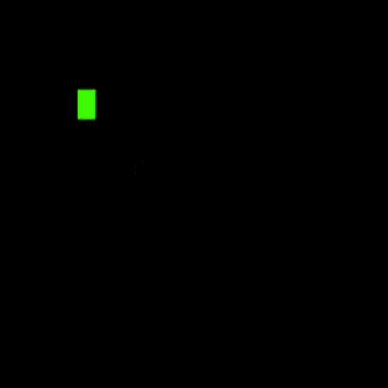
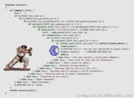

<!-- Last updated: 2026-05-21 04:24:45 UTC -->

<div align="center">

<!-- ═══════════════════════════════════════════════════════════════ -->
<!--                        HEADER                                  -->
<!-- ═══════════════════════════════════════════════════════════════ -->


<br/>


<br/>

<a href="https://www.linkedin.com/in/carter-tierney/">
  
</a>
<a href="mailto:cartertierney0@gmail.com">
  
</a>


</div>

<br/>

<!-- ═══════════════════════════════════════════════════════════════ -->
<!--                      ABOUT ME                                  -->
<!-- ═══════════════════════════════════════════════════════════════ -->

```js
// carter.config.js

const carter = {
    location:    "Atlanta, GA",
    school:      "Georgia State University — M.S. Computer Science",
    interests:   ["building things", "breaking PRs (in the gym)", "anime"],
    funFacts: {
        siblings:       5,
        nflTeam:        "New York Jets 🛩️",
        crunchyroll:    "always watching something",
        goal:           "strongest dev who ships code"
    }
};
```

<div align="center">
<table>
<tr>
<td width="50%" align="center">


<br/><br/>
<strong>writing code</strong>

</td>
<td width="50%" align="center">


<br/><br/>
<strong>shipping projects</strong>

</td>
</tr>
</table>
</div>

<br/>

<!-- ═══════════════════════════════════════════════════════════════ -->
<!--                      TECH STACK                                -->
<!-- ═══════════════════════════════════════════════════════════════ -->

<div align="center">

### `⚡ tech stack`

<br/>


<br/>


</div>

<br/>

<!-- ═══════════════════════════════════════════════════════════════ -->
<!--                     GITHUB STATS                               -->
<!-- ═══════════════════════════════════════════════════════════════ -->

<div align="center">

### `📊 github stats`

<br/>

<a href="https://github.com/ctsc">
  
</a>

<br/><br/>


<br/><br/>

<!-- Contribution Graph -->


<br/><br/>

<!-- Contribution Snake -->
<picture>
  <source media="(prefers-color-scheme: dark)" srcset="https://raw.githubusercontent.com/ctsc/ctsc/output/github-contribution-grid-snake-dark.svg" />
  <source media="(prefers-color-scheme: light)" srcset="https://raw.githubusercontent.com/ctsc/ctsc/output/github-contribution-grid-snake.svg" />
  
</picture>

</div>

<br/>

<!-- ═══════════════════════════════════════════════════════════════ -->
<!--                    POWERLIFTING                                -->
<!-- ═══════════════════════════════════════════════════════════════ -->

<div align="center">

### `🏋️ powerlifting PRs`

<br/>


<br/><br/>

| Lift | PR |
|:---:|:---:|
| **Squat** | `560 lbs` |
| **Bench** | `355 lbs` |
| **Deadlift** | `655 lbs` |
| **Total** | **`1,570 lbs`** |

</div>

<br/>

<!-- ═══════════════════════════════════════════════════════════════ -->
<!--                   DAILY QUOTE                                  -->
<!-- ═══════════════════════════════════════════════════════════════ -->

<div align="center">

### `💭 daily quote`

<br/>



<br/><br/>

> <em id="daily-quote">"Code is like humor. When you have to explain it, it's bad." - Cory House</em>

</div>

<br/>

<!-- ═══════════════════════════════════════════════════════════════ -->
<!--                      FOOTER                                    -->
<!-- ═══════════════════════════════════════════════════════════════ -->

<div align="center">


</div>
