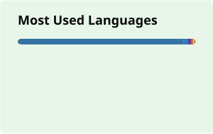

<!-- Last updated: 2026-08-27 08:52:56 UTC -->

<div align="center">

<table width="100%">
<tr>
<td align="center" bgcolor="#e8f5e9">

<br/>


<br/>

<table align="center">
<tr>
<td align="center" bgcolor="#e8f5e9">


<br/>


</td>
</tr>
</table>

<br/><br/>

<a href="https://www.linkedin.com/in/carter-tierney/">
  
</a>
<a href="mailto:cartertierney0@gmail.com">
  
</a>
<a href="https://github.com/ctsc">
  
</a>


<br/><br/>

<table align="center">
<tr>
<td align="left">

```js
// carter.config.js

const carter = {
    location:    "Atlanta, GA",
    school:      "Georgia State University",
    degree:      "M.S. CS | B.S. CS",
    interests:   ["building things", "breaking PRs (in the gym only)", "watching anime"],
    funFacts: {
        siblings:       5,
        nflTeam:        "New York Jets",
        favMovie:       "Rocky",
        goal:           "Strongest SWE in the World"
    }
};
```

</td>
</tr>
</table>

<br/>

<table align="center">
<tr>
<td align="center" width="180">

<br/><br/>
<strong>writing code</strong>
</td>
<td align="center" width="180">

<br/><br/>
<strong>shipping projects</strong>
</td>
<td align="center" width="180">

<br/><br/>
<strong>building vibes</strong>
</td>
</tr>
</table>

<br/>

<h3><code>⚡ tech stack</code></h3>


<br/>


<br/><br/>

<h3><code>📊 github stats</code></h3>


<br/><br/>

<br/><br/>

<br/><br/>


<br/><br/>

<h3><code>🏋️ powerlifting PRs</code></h3>


<br/><br/>

<table align="center">
<tr>
<th align="center">Lift</th>
<th align="center">PR</th>
<th align="center">Progress</th>
</tr>
<tr>
<td align="center"><strong>Squat</strong></td>
<td align="center"><code>560 lbs</code></td>
<td align="center"></td>
</tr>
<tr>
<td align="center"><strong>Bench</strong></td>
<td align="center"><code>355 lbs</code></td>
<td align="center"></td>
</tr>
<tr>
<td align="center"><strong>Deadlift</strong></td>
<td align="center"><code>655 lbs</code></td>
<td align="center"></td>
</tr>
<tr>
<td align="center"><strong>Total</strong></td>
<td align="center"><code>1,570 lbs</code></td>
<td align="center"></td>
</tr>
</table>

<br/>

<h2><strong>goal: strongest developer who ships code</strong></h2>

<br/>

<h3><code>💭 daily quote</code></h3>

<h3><em id="daily-quote">"Code is like humor. When you have to explain it, its bad." - Cory House</em></h3>

<br/>


<br/><br/>


<br/>

<table align="center">
<tr>
<td align="center" bgcolor="#e8f5e9">


</td>
</tr>
</table>

<br/>

</td>
</tr>
</table>

</div>
