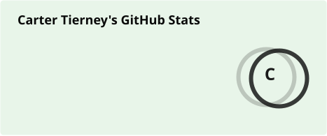

<!-- Last updated: 2026-07-05 18:20:43 UTC -->

<table width="100%">
<tr>
<td align="center" bgcolor="#e8f5e9">

<div align="center">

<!-- HEADER -->


<br/>


<br/>


<br/><br/>

<a href="https://www.linkedin.com/in/carter-tierney/">
  
</a>
<a href="mailto:cartertierney0@gmail.com">
  
</a>
<a href="https://github.com/ctsc">
  
</a>


</div>

<br/>

<!-- ABOUT ME -->

```js
// carter.config.js

const carter = {
    location:    "Atlanta, GA",
    school:      "Georgia State University",
    degree:      "M.S. CS | B.S. CS",
    interests:   ["building things", "breaking PRs (in the gym only)", "watching anime"],
    funFacts: {
        siblings:       5,
        nflTeam:        "New York Jets",
        favMovie:       "Rocky",
        goal:           "Strongest SWE in the World"
    }
};
```

<div align="center">
<table>
<tr>
<td width="33%" align="center">


<br/><br/>
<strong>writing code</strong>

</td>
<td width="33%" align="center">


<br/><br/>
<strong>shipping projects</strong>

</td>
<td width="33%" align="center">


<br/><br/>
<strong>building vibes</strong>

</td>
</tr>
</table>
</div>

<br/>

<!-- TECH STACK -->

<div align="center">

### `⚡ tech stack`

<br/>


<br/>


</div>

<br/>

<!-- GITHUB STATS -->

<div align="center">

### `📊 github stats`

<br/>




<br/><br/>


<br/><br/>


<br/><br/>


</div>

<br/>

<!-- POWERLIFTING -->

<div align="center">

### `🏋️ powerlifting PRs`

<br/>


<br/><br/>

| Lift | PR | Progress |
|:---:|:---:|:---:|
| **Squat** | `560 lbs` |  |
| **Bench** | `355 lbs` |  |
| **Deadlift** | `655 lbs` |  |
| **Total** | **`1,570 lbs`** |  |

<br/>

<h1><strong>goal: strongest developer who ships code</strong></h1>

</div>

<br/>

<!-- DAILY QUOTE -->

<div align="center">

### `💭 daily quote`

<br/>

<h2><em id="daily-quote">"Code is like humor. When you have to explain it, its bad." - Cory House</em></h2>

<br/>


</div>

<br/>

<!-- CURRENTLY -->

<div align="center">

### `🎯 currently`

<br/>

```
 📚  studying           |  M.S. CS + B.S. CS @ GSU
 🏋️  lifting            |  chasing a 1,600+ lb total
 📺  watching            |  whatever is new on Crunchyroll
 🏈  rooting for         |  the Jets (pain is temporary)
 🎬  favorite movie      |  Rocky
 💻  building            |  things that ship
```

</div>

<br/>

<!-- FOOTER -->

<div align="center">


<br/>


</div>

</td>
</tr>
</table>
